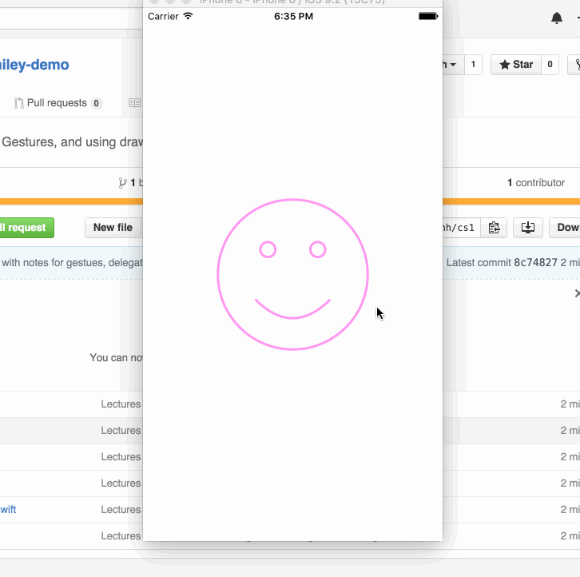

# cs193p-pa1

## Intent
Mainly to summarize lectures 5 and 6's demo of the smiley face app.  This app allows you to make the person happier by panning up, and vice versa.  Also allows for zooming in and out.

## Summary
Around 3 hours of lectures, so I will try my best to butcher this the least I can:
* Protocols: FaceViewDataSource creates a binding contract between View and Controller where View asks Controller about how much to smile.
* Drawing stuff: Using CGPoint and CGFloat (not regular float/ints/doubles!) to get a frame of reference for the FaceView.  Using UIBezier to draw circles and arcs for face, eyes, and mouth.
* Gestures: Two ways of doing gestures -- one is explicitly adding an "addGestureRecognizer" under the FaceView IBOutlet.  The other way is to just ctrl-drag an IBAction from the storyboard.
  * Zoom in/out has Controller listen to View to see if there's any pinching going on.  If there is, it will go ahead and call the View's scaling function which will then zoom the smiley in and out.
  * The panning gesture is observed by Controller once again, but the happiness calculation is done in the Controller (since that is a Controller property and not a View property).  When the Controller's happiness changes, it asks the View to update the UI.  During the UI update, the 'smiliness' (View's analogy of happiness) will derive its value by delegating the calculation to the Controller once again.  The Controller does so and finally updates the View again.
    * TL;DR the flow is: Control listens to View -> View starts to update UI -> Controller does calculations -> View can finish updating UI

## Demo
Why not?
